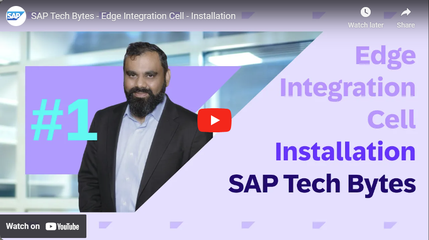

# SAP Edge Integration Cell on Azure Accelerator

This repos serves as an accelerator for [SAP Edge Integration Cell](https://help.sap.com/docs/integration-suite/sap-integration-suite/setting-up-and-managing-edge-integration-cell) (EIC) on [Azure Kubernetes Service](https://learn.microsoft.com/azure/aks/what-is-aks) (AKS). It provides a set of terraform scripts and templates to automate the deployment of the required infrastructure and software components.

Scenarios range from hybrid setups like connecting a local ERP to SAP Sales Cloud, to complete on-premises scenarios like SAP PI/PO to ECC communication within a factory. EIC requires outbound internet connectivity for heartbeats and updates though.

> [!NOTE]
> Learn more about running EIC on validated hardware at the "edge" in your factory, plant, shop floor etc. with Azure Local (formerly Azure Stack HCI) [here](https://learn.microsoft.com/azure/azure-local/).
> AKS gets deployed to HCI via [Azure Arc](https://learn.microsoft.com/azure/aks/hybrid/resource-manager-quickstart). Adjust the terraform scripts to use the [azurerm_arc_kubernetes_cluster](https://registry.terraform.io/providers/hashicorp/azurerm/latest/docs/resources/arc_kubernetes_cluster) provider accordingly.

## Getting Started

[3247839 - Prerequisites for installing SAP Integration Suite Edge Integration Cell](https://me.sap.com/notes/3247839)

[Prepare for your deployment on AKS](https://help.sap.com/docs/integration-suite/sap-integration-suite/prepare-for-deployment-on-azure-kubernetes-service-aks)

> [!IMPORTANT]
> Always verify latest stable AKS version supported by SAP.

[Overview and Installation Guide](https://blogs.sap.com/2023/11/16/next-gen-hybrid-integration-with-sap-integration-suite-edge-integration-cell-introduction-setup/)

### Accelerators

|Solution Type|Description|
|---|---|
|[quickstart > aks](quickstart/aks/README.md)|Provides a non-production quickstart sample using AKS|
|[quickstart > sap](quickstart/sap/README.md)|Provides a non-production quickstart sample using SAP BTP terraform provider|
|quickstart > azure-local (coming soon)|Provides a non-production quickstart sample using Azure Local (formerly Azure Stack HCI)|
|production-ready (coming soon)|Provides a production ready (e.g. HA-Cluster) setup|

## Contributors

- [Aviators community](https://github.com/aviators-germany)
- [Sebastian (Azure MVP), QUIBIQ](https://www.linkedin.com/in/sebastianmeyerit/)

#Kudos for the tremendous contributions😎

## Further Reading

[Please see SAP Documentation for latest updates](https://help.sap.com/docs/integration-suite/sap-integration-suite/prepare-your-kubernetes-cluster)

## Contributing

This project welcomes contributions and suggestions.  Most contributions require you to agree to a
Contributor License Agreement (CLA) declaring that you have the right to, and actually do, grant us
the rights to use your contribution. For details, visit https://cla.opensource.microsoft.com.

When you submit a pull request, a CLA bot will automatically determine whether you need to provide
a CLA and decorate the PR appropriately (e.g., status check, comment). Simply follow the instructions
provided by the bot. You will only need to do this once across all repos using our CLA.

This project has adopted the [Microsoft Open Source Code of Conduct](https://opensource.microsoft.com/codeofconduct/).
For more information see the [Code of Conduct FAQ](https://opensource.microsoft.com/codeofconduct/faq/) or
contact [opencode@microsoft.com](mailto:opencode@microsoft.com) with any additional questions or comments.

## Trademarks

This project may contain trademarks or logos for projects, products, or services. Authorized use of Microsoft 
trademarks or logos is subject to and must follow 
[Microsoft's Trademark & Brand Guidelines](https://www.microsoft.com/en-us/legal/intellectualproperty/trademarks/usage/general).
Use of Microsoft trademarks or logos in modified versions of this project must not cause confusion or imply Microsoft sponsorship.
Any use of third-party trademarks or logos are subject to those third-party's policies.
