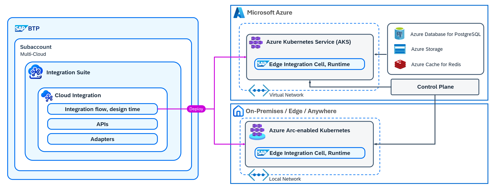
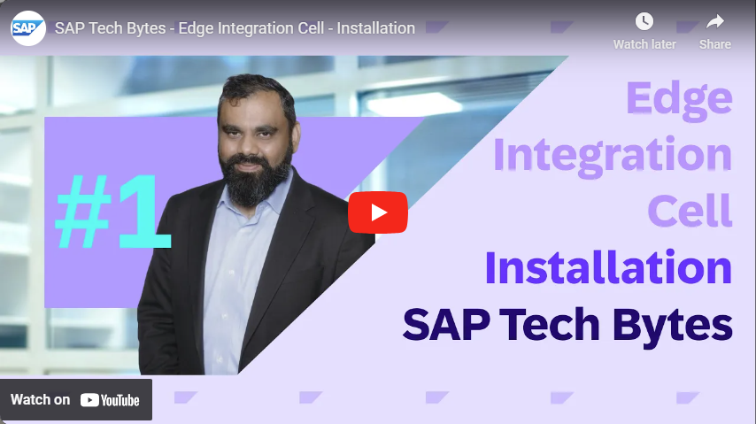

# SAP Edge Integration Cell on Azure Accelerator

This repos serves as an [accelerator](#recommended-accelerators) for [SAP Edge Integration Cell](https://help.sap.com/docs/integration-suite/sap-integration-suite/setting-up-and-managing-edge-integration-cell) (EIC) on [Azure Kubernetes Service](https://learn.microsoft.com/azure/aks/what-is-aks) (AKS). It provides a set of infra-as-code templates to automate the deployment of the required infrastructure and software components.

Scenarios range from hybrid setups like connecting a local ERP to SAP Sales Cloud, to complete on-premises scenarios like SAP PI/PO to ECC communication within a factory. EIC requires outbound internet connectivity for heartbeats and updates though.

Learn more from [this Microsoft Learn article](https://learn.microsoft.com/azure/sap/workloads/sap-edge-integration-cell-with-azure).

## Getting Started

[3247839 - Prerequisites for installing SAP Integration Suite Edge Integration Cell](https://me.sap.com/notes/3247839)

[Prepare for your deployment on AKS](https://help.sap.com/docs/integration-suite/sap-integration-suite/prepare-for-deployment-on-azure-kubernetes-service-aks)

> [!IMPORTANT]
> Always verify latest stable AKS version supported by SAP.

### Recommended Accelerators

|Solution Type|Description|
|---|---|
|[quickstart > aks](quickstart/aks/README.md)|Provides a non-production quickstart sample using AKS|
|[quickstart > sap](quickstart/sap/README.md)|Provides a non-production quickstart sample using SAP BTP terraform provider|
|production-ready > aks (in development) |Builds upon the well-architected framework blueprint setup|

### 📚 Knowledge Base for Azure SRE Agent

The [`knowledge-base/`](knowledge-base/README.md) directory provides agent-friendly operational knowledge for SAP EIC on Azure — architecture, prerequisites, troubleshooting, and runbooks. Add it as a **web page** source in [Azure SRE Agent](https://learn.microsoft.com/azure/sre-agent/) to enable AI-assisted diagnostics for your SAP EIC workloads. Community and agents extend this knowledge collaboratively.

### SAP's classic installation Guide

[Overview and Installation Guide](https://community.sap.com/t5/integration-blog-posts/next-gen-hybrid-integration-with-sap-integration-suite-edge-integration/ba-p/13577780)

[SAP Reference Architecture](https://architecture.learning.sap.com/docs/ref-arch/263f576c90/2)

#### Video Guide for manual setup provided by SAP

This accelerator focuses on Azure provisioning and then hands over to SAP Integration Suite.
For SAP-specific EIC deployment steps in ELM and Integration Suite, always follow SAP's up-to-date documentation and video guidance.

> [!TIP]
> For SSL setup with your local SAP integration flow, provide your own certificate, key file, and DNS configuration. See the [end of above video (22:27m)](https://www.youtube.com/watch?v=PHPPnma7Y1A&t=1347s) for details.

## Contributors

- [Aviators community](https://aviators-germany.de/)
- [Sebastian Meyer (Azure MVP)](https://github.com/qbq-hh-sebastian-meyer)

#Kudos for the tremendous contributions😎

## Further Reading

[Please see SAP Documentation for latest updates](https://help.sap.com/docs/integration-suite/sap-integration-suite/prepare-your-kubernetes-cluster)

## Contributing

This project welcomes contributions and suggestions. Most contributions require you to agree to a Contributor License Agreement (CLA) declaring that you have the right to, and actually do, grant us the rights to use your contribution. For details, visit https://cla.opensource.microsoft.com.

When you submit a pull request, a CLA bot will automatically determine whether you need to provide a CLA and decorate the PR appropriately (e.g., status check, comment). Simply follow the instructions provided by the bot. You will only need to do this once across all repos using our CLA.

This project has adopted the [Microsoft Open Source Code of Conduct](https://opensource.microsoft.com/codeofconduct/).
For more information see the [Code of Conduct FAQ](https://opensource.microsoft.com/codeofconduct/faq/) or
contact [opencode@microsoft.com](mailto:opencode@microsoft.com) with any additional questions or comments.

## Trademarks

This project may contain trademarks or logos for projects, products, or services. Authorized use of Microsoft 
trademarks or logos is subject to and must follow [Microsoft's Trademark & Brand Guidelines](https://www.microsoft.com/en-us/legal/intellectualproperty/trademarks/usage/general). Use of Microsoft trademarks or logos in modified versions of this project must not cause confusion or imply Microsoft sponsorship. Any use of third-party trademarks or logos are subject to those third-party's policies.
